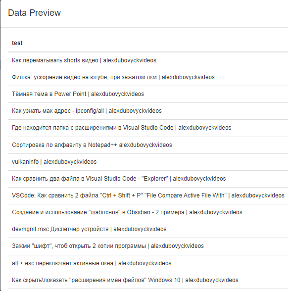
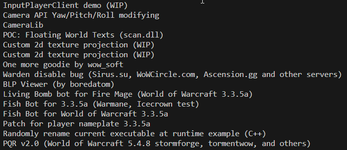
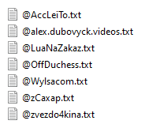
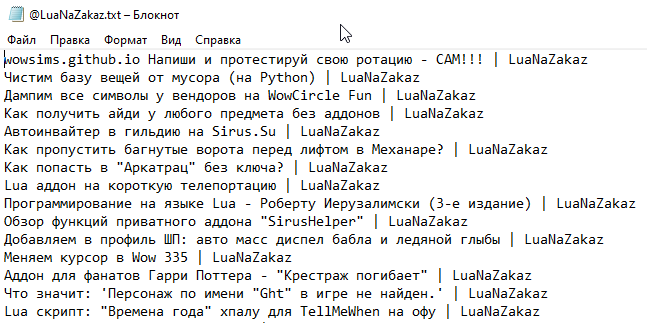

# ytVideoNamesDumper

<p align="center">
    
    
</p>

## Описание

Получаем название всех видеороликов с нужного канала.

В репозитории представлены [3 способа](https://github.com/gitalexhubuser/ytVideoNamesDumper#%D0%B8%D1%81%D0%BF%D0%BE%D0%BB%D1%8C%D0%B7%D0%BE%D0%B2%D0%B0%D0%BD%D0%B8%D0%B5) как это сделать!

Вручную это делал через [Web Scraper - Free Web Scraping](https://chrome.google.com/webstore/detail/web-scraper-free-web-scra/jnhgnonknehpejjnehehllkliplmbmhn)

<details>
<summary>Web Scraper</summary>

С использованием:

Selector `yt-formatted-string#video-title`

type `SelectorText`

Multiple `yes`

Parent selectors `_root`

</details>

Переделал в полноценный проект на Python, который при помощи Selenium - открывает сайт и дампит названия роликов в файл!

**Ps:** проект похож на [BogatovSirusCharDumper](https://github.com/gitalexhubuser/BogatovSirusCharDumper)

---

## Возможности

- [x] Через `Web Scrapper` прям в браузере [демо](https://youtu.be/BxCTb4CjxZA)
- [x] "xml RSS ссылка" последние 15 видеороликов [коммит](https://github.com/gitalexhubuser/ytVideoNamesDumper/tree/6f5691e7b3af995e50a0d2cabcc8bec9e0f3610d)
- [x] Дампер всех всех видео с вкладки /videos (Selenium)

---

## Использование

### Использование (через Web Scrapper)

- [Смотрим видео](https://youtu.be/BxCTb4CjxZA)

<details>
<summary>Результат</summary>



</details>

### Использование (через xml RSS ссылку)

- Устанавливаем [проект](https://github.com/gitalexhubuser/ytVideoNamesDumper/tree/6f5691e7b3af995e50a0d2cabcc8bec9e0f3610d)
- В url передаём ссылку на канал
```bash
url = 'https://www.youtube.com/feeds/videos.xml?channel_id=UCVws9TRZN49QxiIk4Q3VOgg' # atom
```
- Запускаем `main.py`

<details>
<summary>Результат</summary>



</details>

- [Смотрим видео](https://youtu.be/fn6RgjSZfYY)

### Использование (через Selenium)

- Ввоидим название канала для дампа, в файл `main.py`, строка `driver.get(" ссылку сюда! ")`
- Запускаем `run.cmd`
- Получаем текстовый файл с всеми видеороликами в папке results

<details>
<summary>Результат</summary>




</details>

TODO:

[Смотрим видео]()

---

## Установка

TODO

---

# Ссылки
| Описание | Ссылка |
| ------ | ------ |
Репо: | [github.com/gitalexhubuser/ytVideoNamesDumper](https://github.com/gitalexhubuser/ytVideoNamesDumper)
